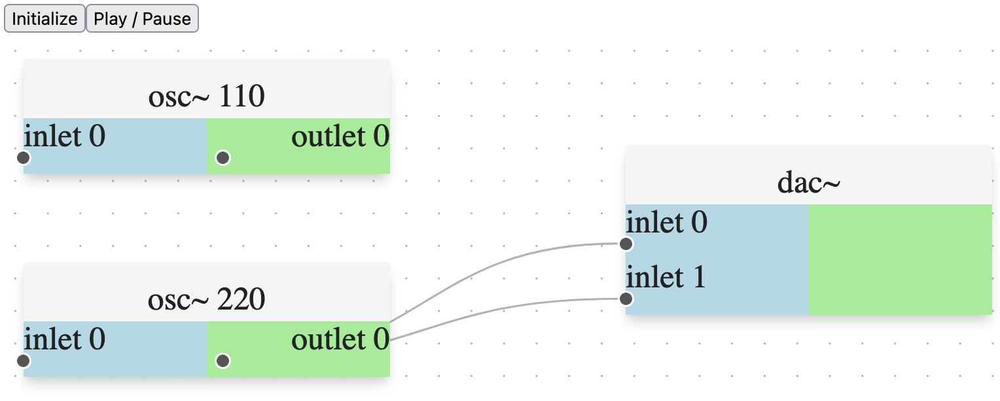

At the moment, this is a hacky WIP sketch. Haven't touched JS in years, and
have never used React.

There's this headless Pure Data engine called
[ZenGarden](https://github.com/mhroth/ZenGarden).

Someone else did [some
work](https://github.com/jacobstern/zengarden-emscripten-demo) to build it
under emscripten and hook it up to the Web Audio API. There's no GUI,
it just loads a patch from a .pd file, sends messages in, gets audio out.

I thought it'd be cool to throw together a quick GUI using this [React
Flow](https://reactflow.dev/) library.

This sketch doesn't quite do anything interesting yet. I need to spend one more
night figuring out the "on edge change" and "on node change" type callbacks.

[Live demo here.](https://joelanders.github.io/reactflow-zengarden/dist/)
